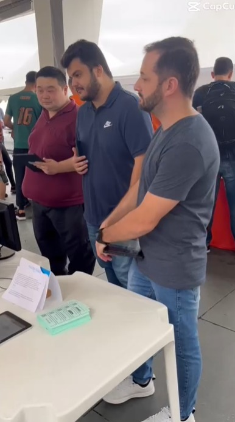
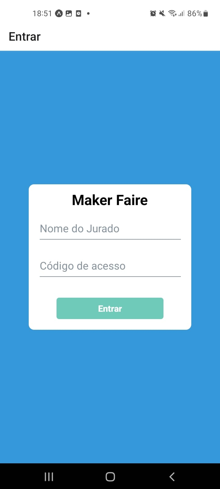
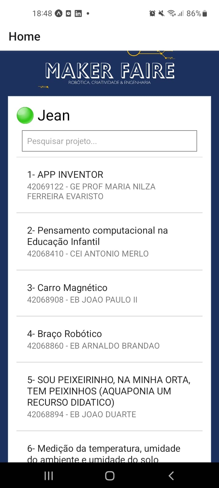
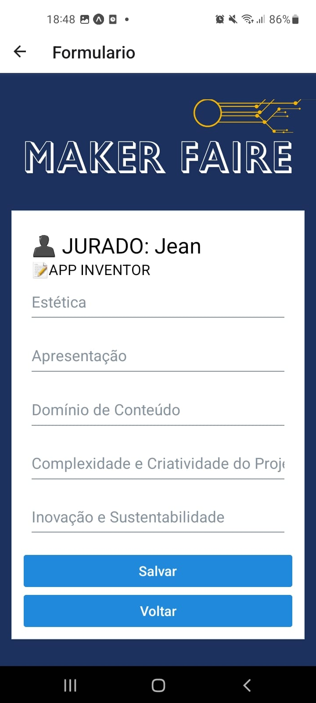
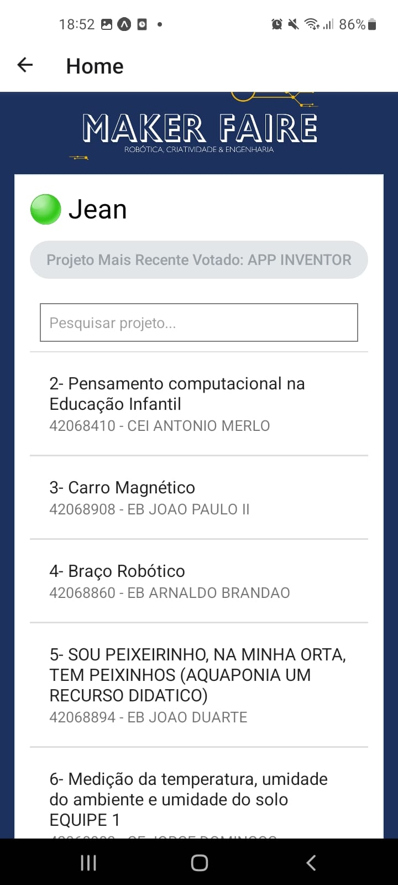

<h1>"# FeiraMaiker"  </h1>
  

  
Este repositório guarda a modesta contribuição que tive na criação de um aplicativo de votação para a Feira Maiker, um evento que reuniu todas as escolas da educação de Itajaí. Desenvolver essa ferramenta não foi apenas uma tarefa técnica, mas uma oportunidade enriquecedora de vivenciar de perto o evento e interagir com os jurados responsáveis pela votação.
  

  
Ver todas as escolas participando ativamente da Feira Maiker foi, por si só, uma experiência gratificante. No entanto, ter a responsabilidade de contribuir para o sucesso do evento ao criar um aplicativo que facilitou a contagem dos votos trouxe uma satisfação ainda maior.
  
Ao observar de perto o trabalho dos jurados, pude perceber a importância de uma ferramenta eficiente para a realização de uma votação justa e precisa. Meu aplicativo não apenas agilizou o processo, mas também proporcionou transparência e confiabilidade na contagem dos votos, elementos essenciais para um evento dessa magnitude.
  
Fico extremamente feliz por ter desempenhado um papel significativo nesse evento incrível, contribuindo para a sua organização e sucesso. A oportunidade de criar o aplicativo de votação para a Feira Maiker não apenas destacou a importância da tecnologia nesse contexto, mas também reforçou meu compromisso em utilizar minhas habilidades para apoiar iniciativas que promovam a educação e a participação ativa dos estudantes.
  
Essa experiência, sem dúvida, deixou uma marca positiva em minha trajetória profissional e pessoal, reforçando a crença de que a tecnologia pode ser uma aliada poderosa na realização de eventos que enriquecem a comunidade educacional.
 
1. Login:
Ao iniciar, faça o login para acessar todas as funcionalidades do aplicativo. 

2. Lista de Projetos:
Após o login, você terá acesso a uma lista completa de todos os projetos participantes da Feira Maker. Navegue pela lista e descubra as incríveis inovações que estão sendo apresentadas.
3. Filtragem de Projetos:
Utilize a funcionalidade de filtragem para encontrar facilmente os projetos que mais chamam a sua atenção. Digite palavras-chave ou utilize outros critérios para refinar a lista conforme suas preferências.

4. Votação:
Ao selecionar o projeto de sua escolha, você será redirecionado para a página de votação. Preencha o formulário com sua avaliação e comentários, contribuindo para reconhecer o talento dos participantes.
 

5. Mensagem de Sucesso:
Após enviar seu voto, uma mensagem de sucesso confirmará que sua participação foi registrada com êxito. Agradecemos por contribuir para a escolha dos melhores projetos da Feira Maker.
6. Retorno à Lista:
Automaticamente, você será redirecionado de volta à lista de projetos, eliminando o projeto que você acabou de avaliar. Isso facilita sua navegação, permitindo que você descubra e vote em mais projetos de maneira ágil.
 

